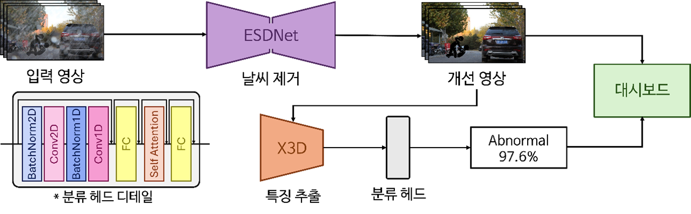

# Capstone Design  
**악천후 및 저조도 환경에서의 영상 개선을 통한 실시간 범죄 행위 탐지 서비스 개발**

**A real-time approach to crime detection through video enhancement in adverse weather and low-light environments**

### Description  
This repository contains the Capstone Design project by the Department of Applied Artificial Intelligence at Seoul National University of Science and Technology. This project enhances low-quality CCTV video affected by adverse weather or low-light conditions and detects criminal activities in real-time using the improved video. Detection results are visualized through a web-based dashboard for intuitive monitoring and quick response.

### References  
- [ESDNet](https://github.com/CVMI-Lab/UHDM)  
- [X3D](https://github.com/facebookresearch/SlowFast)

### Contributors  
- 22102355 Semin Heo  
- 22102321 Chaeyoung Song  
- 21102376 Yeonwoo Lee