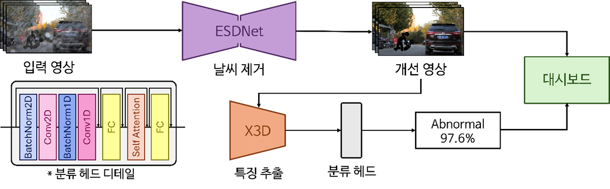

## Capstone Design

This repository contains the capstone design project by the Department of Applied Artificial Intelligence at Seoul National University of Science and Technology.

### Description
**(Korean) 악천후 및 저조도 환경에서의 영상 개선을 통한 실시간 범죄 행위 탐지 서비스 개발**
**(English) A Real-Time Approach to Crime Detection through Video Enhancement in Adverse Weather and Low-Light Environments**

This project enhances low-quality CCTV video affected by adverse weather or low-light conditions and detects criminal activities in real-time using the improved video. Detection results are visualized through a web-based dashboard for intuitive monitoring and quick response.



Pipeline: `frame -> ESDNet (de-weathering) -> 13-frame clip -> X3D features -> Performer-based anomaly classifier -> dashboard`.

### Repository layout

```
capstone/            Python package shared by the demo and the scripts
  config.py            paths and hyperparameters (override with CAPSTONE_* env vars)
  models/              ESDNet, anomaly classifier, X3D builder, weight loading
  data.py              NPYPairedDataset (features), PairedVideoDataset (raw videos)
  losses.py            BCE + triplet loss
  preprocess.py        frame -> tensor, clip normalization
  pipeline.py          AnomalyPipeline: frame -> enhanced frame + anomaly score
  evaluation.py        metrics / evaluation loop
scripts/             CLI entry points (see below)
demo/                Flask dashboard (app.py, streams.py, templates/) + nginx RTMP server
data/lists/          UCF-Crime split lists (.mp4 lists for extraction, .npy lists for training)
weights/             shipped weights (tracked in git, ~100 MB)
tests/               pytest suite (synthetic data, no GPU needed)
third_party/uhdm/    ESDNet upstream training utilities (unused by the pipeline)
notebooks/           visualization notebook
```

### Installation

```bash
python -m venv .venv && source .venv/bin/activate
pip install -r requirements.txt          # CPU; use requirements-cuda.txt for CUDA 12.4
pip install -e ".[dev]"                  # optional: installs the package + pytest
pytest                                   # ~1 min on CPU
```

Feature extraction additionally needs `av` and pytorchvideo from git (PyPI's 0.1.5 is incompatible
with current torchvision):

```bash
pip install av "pytorchvideo @ git+https://github.com/facebookresearch/pytorchvideo.git"
```

The X3D backbone definition is fetched once through `torch.hub` (cached under `~/.cache/torch/hub`);
its weights are loaded from `weights/x3d_s_weights.pth` / `x3d_m_weights.pth`.

### Weights (`weights/`)

| File | Used by | Note |
|---|---|---|
| `deweathering_model.pth` | demo, extraction, e2e training | ESDNet state_dict |
| `De_final_model.pth` | demo, evaluation | anomaly classifier state_dict |
| `x3d_s_weights.pth`, `x3d_m_weights.pth` | demo (`x3d_s`), extraction (`x3d_m`) | X3D without classification head |
| `888tiny.pkl` | – | alternative classifier checkpoint, same architecture |
| `checkpoint_latest.tar` | – | ESDNet training checkpoint (not loaded anywhere) |

Override locations with `CAPSTONE_WEIGHTS_DIR`, `CAPSTONE_DEWEATHER_WEIGHTS`, `CAPSTONE_CLASSIFIER_WEIGHTS`.

### Running the demo

```bash
python demo/app.py --port 5050            # add --device cpu|cuda, or set CAPSTONE_DEVICE
```

Open `http://localhost:5050`. The four tiles are:

| key | source | processing |
|---|---|---|
| `stream0` | `demo/demo_video.mp4` (looped) | ESDNet + anomaly detection |
| `stream1` | `rtmp://localhost:1935/live/stream1` | ESDNet + anomaly detection |
| `stream2`, `stream3` | `rtmp://localhost:1935/live/<key>` | relayed as-is |

A red border and a log line appear when the anomaly score stays at or above `ANOMALY_THRESHOLD`
(0.90) for `ALERT_FRAMES` (10) consecutive clips. RTMP tiles reconnect automatically while no
publisher is connected. `CAPSTONE_RTMP_URL` changes the RTMP base URL; `CAPSTONE_SHARE_MODELS=1`
loads one model set for both enhanced streams instead of two.

#### RTMP server (nginx + nginx-rtmp-module)

`demo/nginx-1.25.2/` is the nginx source tree used for the demo, built with
`./configure --with-http_ssl_module --add-module=../nginx-rtmp-module` (a Linux binary is in
`objs/`). To rebuild:

```bash
git submodule update --init                 # fetches demo/nginx-rtmp-module
cd demo/nginx-1.25.2
./configure --with-http_ssl_module --add-module=../nginx-rtmp-module && make
```

Add an RTMP block to the nginx config and start it, then publish with e.g.
`ffmpeg -re -i input.mp4 -c copy -f flv rtmp://localhost:1935/live/stream1`:

```nginx
rtmp {
    server {
        listen 1935;
        application live { live on; record off; }
    }
}
```

### Training and evaluation

```bash
# 1. extract de-weathered X3D features from UCF-Crime videos (x3d_m, one .npy per video)
python scripts/extract_features.py --list Anomaly_Train.txt --video-root <videos> --save-root <feats>

# 2. train the classifier on the features (pairs of normal/abnormal samples, triplet + BCE loss)
python scripts/train.py --train-root <feats> --val-root <val_feats> --epochs 100
#    --init-weights weights/De_final_model.pth to fine-tune, --resume runs/<run>/checkpoint.pt to continue
#    outputs: runs/<timestamp>/{last.pth,best.pth,checkpoint.pt,history.json}

# 3. evaluate
python scripts/evaluate.py --root <val_feats> --list ucf_x3d_test.txt --weights runs/<run>/best.pth

# optional: fine-tune ESDNet + X3D + classifier jointly on raw videos
python scripts/train_e2e.py --video-root <videos> --epochs 10
```

List files are looked up under `data/lists/` unless a path is given. All scripts accept `--help`.

### Known limitations (kept on purpose, see REFACTORING_PLAN.md)

- The classifier's `DECOUPLED` block reshapes `(B, T, H, W, C)` with `view` instead of `permute`, so
  its convolutions do not run on a true channel-first layout. The shipped weights were trained this
  way, so it is left unchanged (fixing it requires retraining).
- Offline feature extraction uses `x3d_m` at 224 px / 15 frames (assuming 15 fps), while the demo
  and end-to-end training use `x3d_s` at 160 px / 13 frames of consecutive frames.
- Triplet margin (100) and Performer head settings are unchanged from the original experiments.

### References
- [ESDNet](https://github.com/CVMI-Lab/UHDM)
- [X3D](https://github.com/facebookresearch/SlowFast)

### Contributors
- 22102355 Semin Heo
- 22102321 Chaeyoung Song
- 21102376 Yeonwoo Lee
